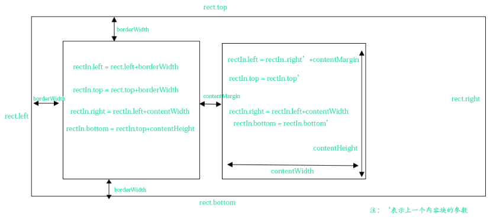
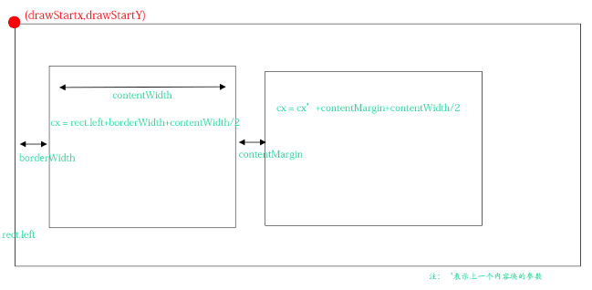
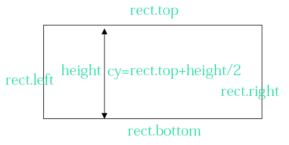
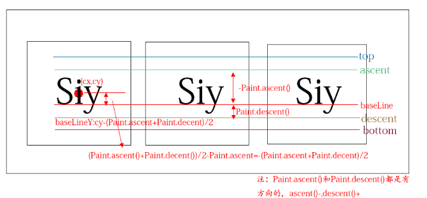
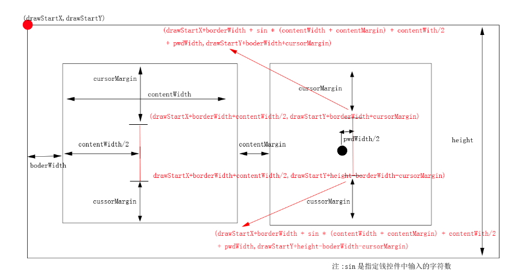

# 一个高度灵活的仿微信密码框
## jcenter地址
依赖：
```gradle
implementation 'coder.siy:password-textView:1.0.0'
```

## Demo截图


## 绘制原理图


## 绘制黑色的底
```java
/** 
    * 绘制边框,先绘制一整块区域 
    */  
   private void drawBoarder(Canvas canvas) {  
       canvas.drawRoundRect(rect, borderRadius, borderRadius, borderPaint);  
   }  
```
rect:黑色长方形大小。

borderRadius:黑色长方形的圆角度数，当为0时就是直角

borderPaint:黑色长方形的画笔

Canvas.drawRoundRect:绘制的是圆角矩形

## 绘制白色内容区域
```java
/** 
     * 绘制内容区域,和内容边界 
     * 
     * @param canvas 
     */  
    private void drawContent(Canvas canvas) {  
        //每次绘制是都要重置rectIn的位置  
        rectIn.left = rect.left + borderWidth;  
        rectIn.top = rect.top + borderWidth;  
        rectIn.right = rectIn.left + contentWidth;  
        rectIn.bottom = rectIn.top + contentHeight;  
  
        for (int i = 0; i < pwdLen; i++) {  
            canvas.drawRoundRect(rectIn, contentRadius, contentRadius, contentPaint);  
            canvas.drawRoundRect(rectIn, contentRadius, contentRadius, contentBoardPaint);  
            rectIn.left = rectIn.right + contentMargin;  
            rectIn.right = rectIn.left + contentWidth;  
        }  
    } 
```
rectIn:白色的正方形大小。

绘制白色正方形的时候有2个考虑点：borderWidth和contentMargin。

borderWidth:每一个白色的正方形顶部(底部)距离黑色长方形顶部(底部)距离，第一个白色正方形的左边距离黑色长方形左边的距离，最后一个白色正方形的右边距离黑色长方形右边的距离。

contentMargin:每一个白色正方形相互之间的间隔。

然后仔细计算每次绘制rectIn。


## 绘制密码显示的圆点
```java
/** 
     * 绘制密码 
     * 
     * @param canvas 
     */  
    private void drawPwd(Canvas canvas) {  
        float cy = rect.top + height / 2;  
        float cx = rect.left + contentWidth / 2 + borderWidth;  
  
        CharSequence nowText = getText();  
        for (int i = 0; i < curLenght; i++) {  
            if (isShowPwdText) {  
                String drawText = String.valueOf(nowText.charAt(i));  
                canvas.drawText(drawText, 0, drawText.length(), cx, cy - pwdTextOffsetY, pwdTextPaint);  
            } else {  
                canvas.drawCircle(cx, cy, pwdWidth / 2, pwdPaint);  
            }  
            cx = cx + contentWidth + contentMargin;  
        }  
    } 
```
### cx:

### cy:


## 绘制明文
```java
/** 
     * 绘制密码 
     * 
     * @param canvas 
     */  
    private void drawPwd(Canvas canvas) {  
        float cy = rect.top + height / 2;  
        float cx = rect.left + contentWidth / 2 + borderWidth;  
  
        CharSequence nowText = getText();  
        for (int i = 0; i < curLenght; i++) {  
            if (isShowPwdText) {  
                String drawText = String.valueOf(nowText.charAt(i));  
                canvas.drawText(drawText, 0, drawText.length(), cx, cy - pwdTextOffsetY, pwdTextPaint);  
            } else {  
                canvas.drawCircle(cx, cy, pwdWidth / 2, pwdPaint);  
            }  
            cx = cx + contentWidth + contentMargin;  
        }  
    } 
```


如果你这样 canvas.drawText(drawText, 0, drawText.length(), cx, cy, pwdTextPaint);绘制明文你会发现明文其实是偏中上位置的。因为cy所代表的是基线的位置.x其实可以直接使用cx的，只要设置pwdTextPaint的setTextAlign(Paint.Align.CENTER)，默认是Paint.Align.LEFT。这个属性是x相对于绘制字符串的位置，如果是Paint.Align.LEFT则x在绘制字符串的左边，如果是Paint.Align.CENTER则x在绘制字符串的中间，显然符合我们的需求。为什么没有拿top和bottom计算baseLineY呢？因为系统建议的，绘制单个字符时字符的最高高度应该是ascent最低高度应该是descent。所以计算出来baseLineY:cy-(paint.ascent()+paint.descent())/2。

## 绘制光标
```java
 /**
     * 绘制光标
     *
     * @param canvas
     */
    private void drawCursor(Canvas canvas) {
        float startX, startY, stopY;
        int sin = curLenght - 1;
        float half = contentWidth / 2;

        if (sin == -1) {
            startX = borderWidth + half;
            startY = cursorMargin + borderWidth;
            stopY = height - borderWidth - cursorMargin;
            canvas.drawLine(drawStartX + startX, drawStartY + startY, drawStartX + startX, drawStartY + stopY, cursorPaint);
        } else {
            startY = cursorMargin + borderWidth;
            stopY = height - borderWidth - cursorMargin;

            if (isShowPwdText) {
                String s = String.valueOf(getText().charAt(sin));
                pwdTextPaint.getTextBounds(s, 0, s.length(), textBoundrect);
                startX = borderWidth + sin * (contentWidth + contentMargin) + half + textBoundrect.width() / 2 + cursourMarginPwd;
            } else {
                startX = borderWidth + sin * (contentWidth + contentMargin) + half + pwdWidth / 2 + cursourMarginPwd;
            }
            canvas.drawLine(drawStartX + startX, drawStartY + startY, drawStartX + startX, drawStartY + stopY, cursorPaint);
        }
    }
```


绘制光标的时候需要注意：第一个密码输入框在没有输入字符时它应该显示在密码输入框中间，如果输入了字符就显示在字符右边.还需要注意字符是明文还是密文，因为我们需要分别计算明文和密文的宽度。

## 绘制分割线
```java
/** 
     * 绘制分割线 
     * 
     * @param canvas 
     */  
  
    private void drawSplitLine(Canvas canvas) {  
        float startX = rect.left + borderWidth + contentWidth + (contentMargin / 2.0f);  
        for (int i = 1; i < pwdLen; i++) {  
            canvas.drawLine(startX, rect.top + borderWidth, startX, rect.bottom - borderWidth, splitLinePaint);  
            startX = startX + contentWidth + contentMargin;  
        }  
    } 
```

## 代码
```xml
   <coder.siy.view.PwTextView
        android:id="@+id/pwdviewId"
        android:layout_width="match_parent"
        android:layout_height="100dp"
        android:textColor="@color/colorAccent"
        android:textSize="26sp"/>
```
## 对外接口
| 接口名称 | 参数 | 参数类型 | 默认值 | 解释 |
| :---: | :---: | :-------: | :---: | :---:|
| showCursor | 无 | 无 | 无 | 显示光标 |
| hideCursor | 无 | 无 | 无 | 隐藏光标 |
| isShowCursor | 无 | 无 | 无 | 判断光标是否显示 |
| setBorderColor | borderColor | int |Color.parseColor("#818b90") |设置边框的颜色|
|setBorderWidth|borderWidth|int|1dip|设置边框的宽|
|setBorderRadius|borderRadius|int|0|设置边框的圆角|
|setContentColor|contentColor|int|Color.WHITE|设置内容的颜色|
|setContentRadius|contentRadius|int|0|设置内容的圆角|
|setSplitLineColor|splitLineColor|int|Color.parseColor("#818b90")|设置分割线的颜色|
|setCursorColor|cursorColor|int|Color.parseColor("#000000")|设置光标的颜色|
|setCursorMargin|cursorMargin|int|10dip|设置光标距离边框的距离|
|setPwdLen|pwdLen|int|6|设置密码长度|
|getPwdLen|无|无|6|获取当前密码框密码的长度|
|setPwdColor|pwdColor|int|Color.parseColor("#000000")|设置密码显示小圆点的颜色|
|setPwdWidth|pwdWidth|int|28dip|设置密码显示小圆点直径|
|setContentMargin|contentMargin|int|1dip|设置内容区域之间的间隔|
|setContentBoardColor|contentBoardColor|int|Color.TRANSPARENT|设置内容边界的颜色|
|setContentBoardWidth|contentBoardWidth|int|0|设置内容边界的宽度|
|setAppendText|appendText|CharSequence|null|用追加的形式传入信息|
|deleteLast|无|无|无|从追后一个字符逐个删除|
|showPwdText|showPwdText|boolean|false|是否显示明文|
|isShowPwdText|无|无|无|当前显示的是否是明文|

详细请查看：[这里](https://blog.csdn.net/baidu_34012226/article/details/80270311)
