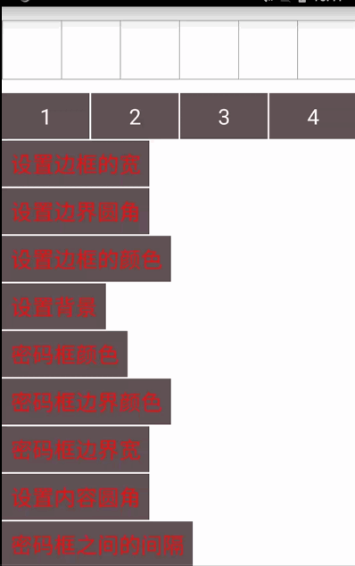

# 一个高度灵活的仿微信密码框
依赖：
implementation 'com.siyer:pwdview:1.0.0‘

## Demo截图


## 绘制原理图
！[demo](./show1.gif)

## 代码
```xml
<com.siy.pwdview.PwdView
	android:id="@+id/pwdviewId"
	android:layout_width="match_parent"
	android:layout_height="100dp"
	android:textColor="@color/colorAccent"
	android:textSize="26sp"/>
```
## 对外接口
| 接口名称 | 参数 | 参数类型 | 默认值 | 解释 |
| :---: | :---: | :-------: | :---: | :---:|
| showCursor | 无 | 无 | 无 | 判断光标是否显示 |
